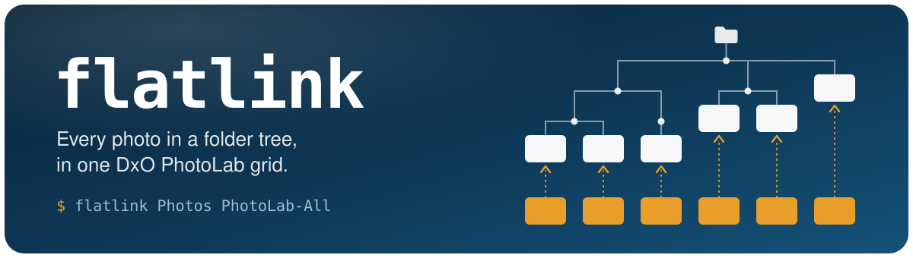
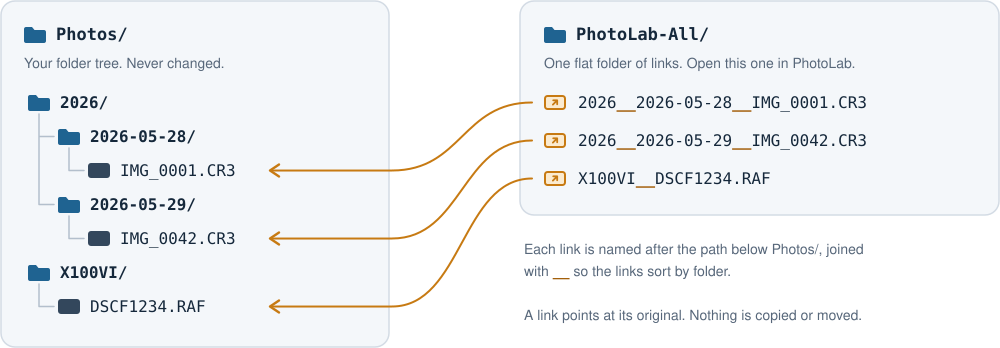
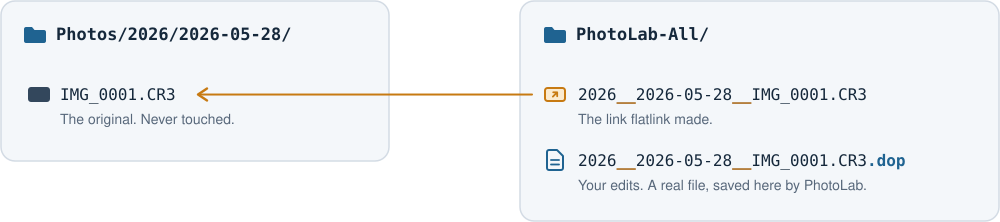

<div align="center">



<p>
  <a href="https://github.com/tsvb/flatlink/actions/workflows/ci.yml"></a>
  <a href="https://github.com/tsvb/flatlink/releases/latest"></a>
  
  
  
</p>

<p>
  <a href="#install">Install</a> ·
  <a href="#use">Use</a> ·
  <a href="#options">Options</a> ·
  <a href="#tips">Tips</a> ·
  <a href="#where-your-edits-are-saved">Your edits</a> ·
  <a href="#why-photolab-needs-this">Why</a>
</p>

</div>

PhotoLab's folder browser shows only the images at the top level of the folder you select. Photos
filed in subfolders — by year, by day, by camera — never appear together. `flatlink` builds a
flat folder of symlinks to every image in a tree. Open that folder in PhotoLab and it's all there.

<picture>
  <source media="(prefers-color-scheme: dark)" srcset="docs/assets/how-it-works-dark.svg">
  
</picture>

Your photos are never moved, copied or modified. The only thing the tool ever creates or removes is
symlinks inside the folder you point it at, and that folder itself if it isn't there yet.

## Install

The command:

```bash
brew install tsvb/tap/flatlink
```

The app, which does the same from a window and can update the links by itself after each import
(see [the app](#the-app)):

```bash
brew install --cask tsvb/tap/flatlink-app
```

Or download `flatlink-app-…-macos.zip` from the [latest release](https://github.com/tsvb/flatlink/releases/latest)
and move Flatlink.app to Applications.

Both are universal (Apple silicon and Intel), signed and notarized, for macOS 14 or later. No
Python or other runtime needed. macOS only: there is no Windows or Linux version.

## Use

```bash
flatlink ~/Pictures/Photos ~/Pictures/PhotoLab-All
```

```text
link  2026__2026-05-28__IMG_0001.CR3
link  2026__2026-05-29__IMG_0042.CR3
link  X100VI__DSCF1234.RAF

created 3, kept 0, skipped 0, pruned 0  ->  /Users/you/Pictures/PhotoLab-All
```

Then open `~/Pictures/PhotoLab-All` in PhotoLab.

Run the same command again after each import: existing links are kept and only new photos are
linked. A link is named after the path below the source, joined with `__`, so
`2026/2026-05-28/IMG_0001.CR3` becomes `2026__2026-05-28__IMG_0001.CR3` and the links sort by folder.

### Options

| Option | Effect |
| --- | --- |
| `-n`, `--dry-run` | Show what would change, and what would go wrong; change nothing. Try this first. |
| `--skip-paired-jpegs` | If you shoot RAW+JPEG, leave out each JPEG that has a RAW of the same name in the same folder, so every shot appears once — as its RAW. |
| `--prune` | Remove links into the source whose original photo has been deleted. Links to anything outside the source are left alone, and so is a link whose original can't be reached. If the source holds no images at all, nothing is removed: that is what an unplugged drive looks like. |
| `--ext EXT` | Only link files with this extension; repeatable (`--ext cr3 --ext jpg`) or as a list (`--ext cr3,jpg`). Each spelling counts: `--ext jpg` leaves out `.jpeg`. By default: JPEG, TIFF, HEIC, PNG and 24 RAW formats. |
| `--` | What follows is the source and the destination, even if it starts with `-`. |
| `-h`, `--help` | Show the help. |
| `--version` | Show the version. |

`--ext cr3`, `--ext .CR3` and `--ext=cr3` all mean the same. An extension that isn't in the list
below is linked all the same, with a note saying so.

<details>
<summary>The formats linked by default</summary>

| Kind | Extensions |
| --- | --- |
| JPEG | `jpg` `jpeg` `jpe` |
| TIFF | `tif` `tiff` |
| HEIC | `heic` `heif` |
| PNG | `png` |
| RAW | `3fr` `arw` `cr2` `cr3` `crw` `dng` `erf` `fff` `gpr` `iiq` `mef` `mos` `mrw` `nef` `nrw` `orf` `pef` `raf` `rw2` `rwl` `sr2` `srf` `srw` `x3f` |

Upper or lower case makes no difference.

</details>

### What is linked, and what is left alone

Hidden files, the contents of packages (such as `.photoslibrary`), existing symlinks and the
destination folder itself are skipped. A file already in the destination is never replaced: it is
reported and left alone. So is a link that points somewhere else, with one exception: a broken link
that was made for the same photo, or that points into the source, is pointed at the photo again.

### When a photo is left out

Every photo that is left out is named on stderr, with the reason:

| It says | What happened, and what to do |
| --- | --- |
| `skip (link name … belongs to …)` | **Two photos with the same link name.** Names are joined with `__`, so `a/b__c.jpg` and `a__b/c.jpg` both ask for `a__b__c.jpg`, and on a drive that ignores case so do `IMG.JPG` and `img.jpg`. The link stays with the photo it already leads to, or goes to the first by path; rename one of the others to bring it in. |
| `skip (real file in the way)` | **A file with the link's name is already in the link folder.** It is never replaced; move it out to let the link in. |
| `skip (link exists, points elsewhere)` | **A link with that name leads to something else.** It is left alone; remove it if it isn't one you need. |
| `unreadable` | **A folder that can't be read**, for lack of permission. Its photos are missing from the link folder until it can. |
| `failed` | **A link name that is too long.** A file name holds 255 bytes, which a very deep path can exceed; shorten the names of the folders above the photo. Any other reason a link could not be made or removed is given in the same way. |

### Exit status

| Status | Meaning |
| --- | --- |
| `0` | Every image under the source has its link. |
| `1` | Some images don't, no image was found, a link could not be removed or the link folder can't be used. Each is named on stderr. |
| `64` | Usage error, a source that is not a folder, or a destination that is the source. |

### Undo

Remove the links and nothing else, which leaves the edits saved in the link folder where they are:

```bash
find ~/Pictures/PhotoLab-All -maxdepth 1 -type l -delete
```

To remove the tool:

```bash
brew uninstall flatlink
```

## Tips

- **External drives:** put the link folder on the same drive as the photos
  (`/Volumes/Photos/PhotoLab-All`), so it travels with the drive. The drive must be formatted APFS or
  Mac OS Extended — exFAT can't hold symlinks. A link folder on your Mac works too, but PhotoLab shows
  the images as missing while the drive is unplugged.
- **Moved photos, renamed drive:** links hold the full path of the original, so they break when the
  photo folder moves or the drive mounts under another name. Run `flatlink` again with the new
  location and the same link folder: every link is pointed at the new place, under the same name, so
  your edits stay attached.
- **One source per link folder:** link names come from the path below the source, so two sources
  that both hold `IMG_0001.CR3` compete for one link, and for the edits saved beside it.
- **Large archives:** a folder of many thousands of images can make PhotoLab slow to browse. Run the
  tool once per camera or per year into separate link folders if it does.

## Where your edits are saved

PhotoLab saves your edits in a `.dop` sidecar **beside the link**, named after it, not beside the
original. The original photo is never touched. (Measured in PhotoLab 9.12.)

<picture>
  <source media="(prefers-color-scheme: dark)" srcset="docs/assets/edits-dark.svg">
  
</picture>

That makes the link folder the home of your PhotoLab edits, so:

- **Keep it.** Don't delete and rebuild the link folder once you've edited in it; re-run `flatlink`
  into the same folder instead. It only ever adds or removes symlinks, never a `.dop`.
- **Rename source folders with care.** A link's name comes from its path below the source, so
  renaming `2026-05-28/` gives its photos new links, and PhotoLab sees them as unedited. The old
  `.dop` files stay in the link folder, under the old names.
- **Other apps won't see these edits**, because they aren't beside the original. Export from
  PhotoLab to share the results.

## Why PhotoLab needs this

PhotoLab 9 lists a folder through its Filesystem plugin, which calls `NSFileManager`'s
`enumeratorAtURL:includingPropertiesForKeys:options:errorHandler:` with options `7`: skip
subdirectory descendants, skip package descendants, skip hidden files. There is no setting to change
it; the same listing feeds both the folder tree and the image grid. The code that sorts the results
does resolve symlinks and aliases, which is what this tool relies on. (Measured in PhotoLab 9.12.)

## Build from source

```bash
swift build -c release
```

```bash
swift test
```

The binary is `.build/release/flatlink`. Requires Xcode 16 or later. No dependencies. Releases are
built, signed, notarized and tagged by [scripts/release.sh](scripts/release.sh), with the Xcode named
in [.xcode-version](.xcode-version); CI builds and tests with the same one, on Apple silicon and,
under Rosetta, on Intel.

## The app

Flatlink.app ([install](#install); source in [App/](App)) puts a window on the same code: keep a list of photo folders and their
link folders, preview what would change, update with one click, and open the result in PhotoLab.

With **Update automatically** on, it watches the photo folder and updates the links a few seconds
after an import has finished: new photos are linked, and with pruning on, deleted ones unlinked.
It catches up when it starts, when the switch is turned on and when the drive is plugged back in,
and it keeps watching with its window closed, for as long as it runs. Turn on **Open Flatlink at
login** in its Settings (⌘,) to have it start hidden when you log in and keep watching after a
restart; it is listed, and can be switched off, in System Settings › General › Login Items. Only images or folders
coming, going or being renamed count, so the files Capture One or PhotoLab write don't set it off.

```bash
cd App && xcodegen generate && open Flatlink.xcodeproj
```

The Xcode project is generated from [App/project.yml](App/project.yml) by
[XcodeGen](https://github.com/yonaskolb/XcodeGen) and not committed; releases and CI use the version
in [.xcodegen-version](.xcodegen-version). The app is not sandboxed, for
the same reason the command isn't: it reads whole photo trees and checks where every link leads.
The icon is drawn by [App/scripts/make-icon.swift](App/scripts/make-icon.swift), and
[App/scripts/open-as-login-item.swift](App/scripts/open-as-login-item.swift) opens a build the way
macOS does at login, to try that without logging out.

## License

MIT — see [LICENSE](LICENSE).

Not affiliated with or endorsed by DxO. DxO and PhotoLab are trademarks of DxO Labs.
